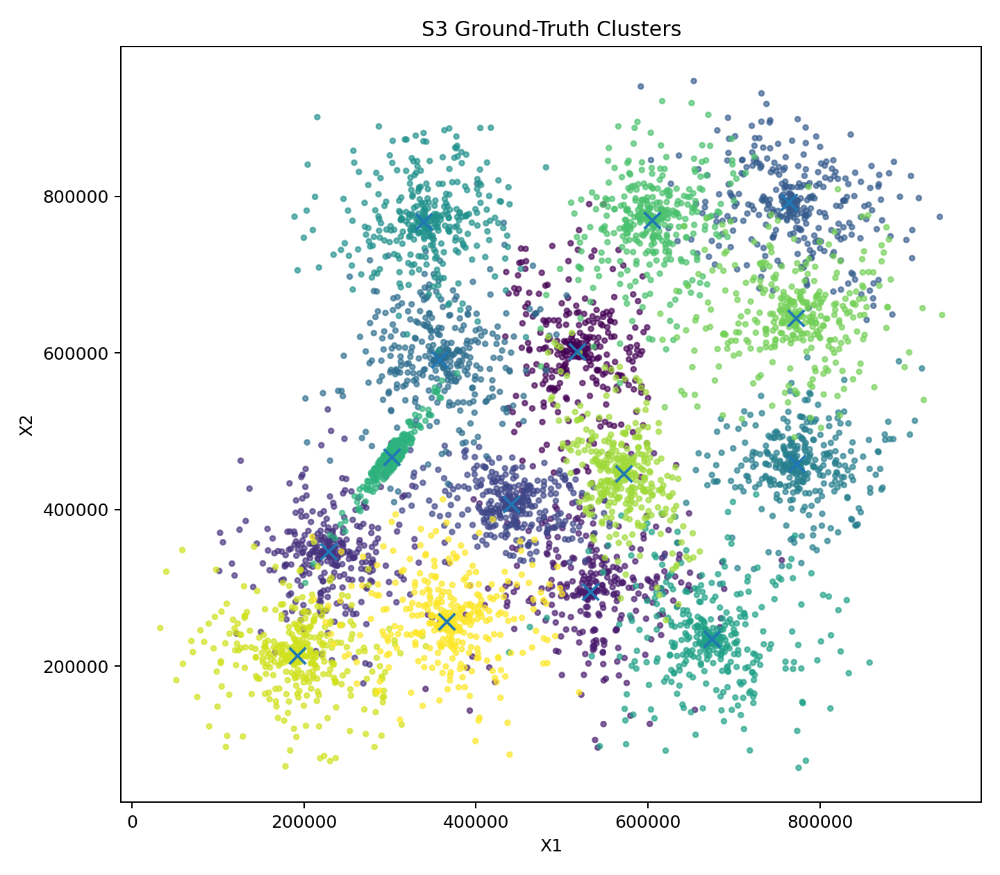
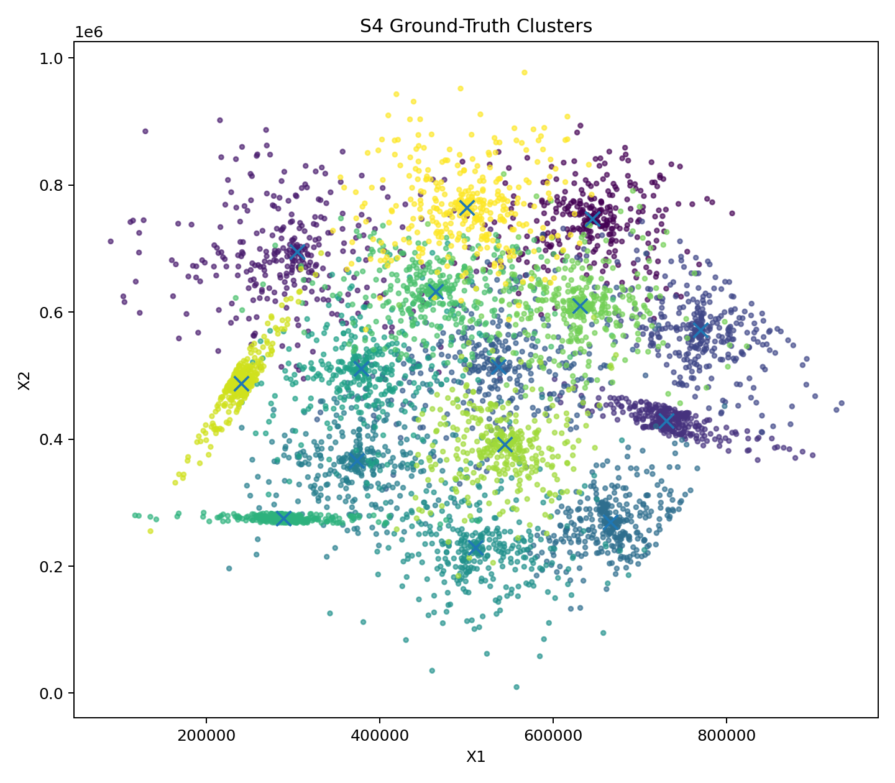
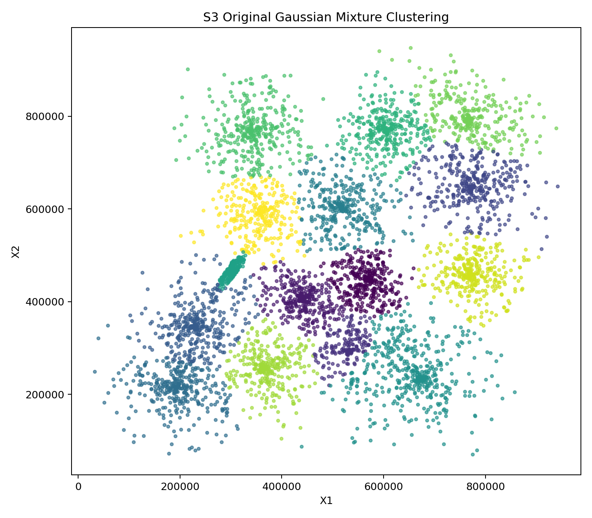
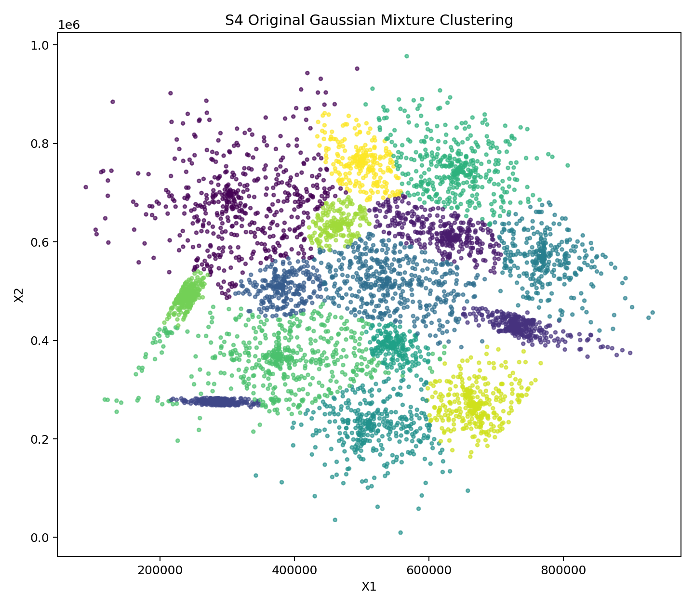
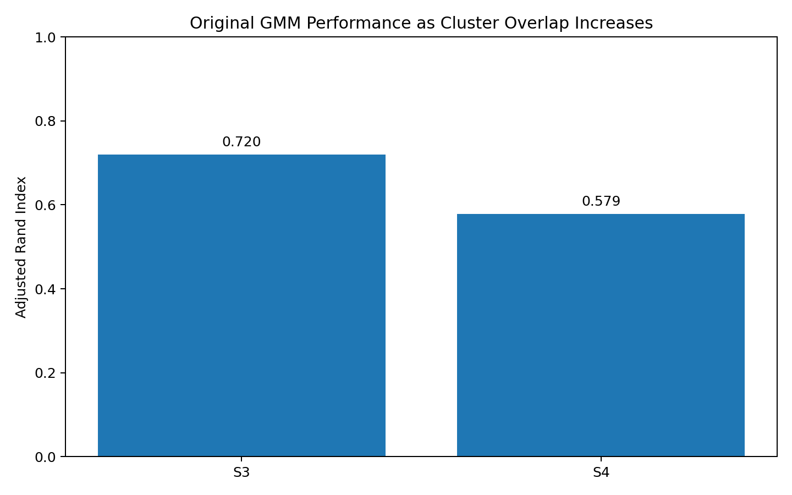

# Clustering Under Increasing Overlap: S3 vs S4

**Benchmarking unsupervised clustering algorithms on synthetic Gaussian data with known ground truth**

This R project studies a practical question in unsupervised learning:

> **How does increasing cluster overlap affect clustering accuracy and algorithm behavior?**

The analysis uses the **S3** and **S4** datasets from the University of Eastern Finland clustering benchmark collection. Both contain **5,000 two-dimensional observations and 15 Gaussian clusters**, while S4 has stronger cluster overlap and is therefore more difficult.

## Why This Project Is Useful

Unlike clustering on an unlabeled real-world dataset, S3 and S4 provide known
ground-truth partitions and centroids. This makes it possible to evaluate
clustering algorithms objectively rather than relying only on internal
indices such as silhouette score.

The project combines:

- external validation against known truth;
- internal cluster-quality assessment;
- runtime comparison;
- centroid-recovery analysis;
- density-based noise detection;
- Gaussian-mixture model selection with BIC.

## Original Project Baseline

The original R analysis used `mclust::Mclust` with 15 Gaussian-mixture
components and evaluated the predicted partition with Adjusted Rand Index.

Recovered baseline results from the supplied project outputs:

| Dataset | ARI | NMI | Silhouette | Matched Accuracy | Centroid RMSE |
|---|---:|---:|---:|---:|---:|
| S3 | 0.7201 | 0.7967 | 0.4598 | 0.8494 | 8798.7 |
| S4 | 0.5785 | 0.7105 | 0.3663 | 0.7662 | 10187.8 |

The decline from **ARI 0.720 on S3** to **0.579 on S4**
illustrates the effect of stronger overlap on cluster recovery.

## Ground Truth

### S3



### S4



## Original Gaussian Mixture Results

### S3



### S4



## Overlap Sensitivity



## Enhanced Benchmark

The refactored analysis compares four complementary clustering approaches:

1. **K-Means** — centroid-based partitioning
2. **Gaussian Mixture Model (GMM)** — probabilistic model-based clustering
3. **Ward Hierarchical Clustering** — agglomerative variance-minimizing clustering
4. **HDBSCAN** — density-based clustering with automatic noise detection

For K-Means, GMM, and Ward clustering, the known benchmark value of
`k = 15` is supplied. HDBSCAN is allowed to infer its own cluster structure.

### Evaluation Metrics

The benchmark reports:

- **Adjusted Rand Index (ARI)** — agreement with ground truth, corrected for chance
- **Normalized Mutual Information (NMI)** — information overlap between partitions
- **Silhouette Score** — internal cluster separation/cohesion
- **Matched Accuracy** — accuracy after optimal cluster-label permutation
- **Centroid RMSE** — distance between recovered and ground-truth centroids
- **Predicted cluster count**
- **Noise fraction**
- **Runtime**

This matters because a single metric can be misleading. For example, a
density-based method may obtain a high silhouette score by labeling difficult
boundary observations as noise while recovering fewer of the true points.

## GMM Model Selection

The enhanced script also asks a separate unsupervised question:

> If the number of clusters were not supplied, how many mixture components
> would BIC select?

The analysis searches candidate component counts from 2 through 25 using
`mclust`.

## Repository Structure

```text
s3-s4-clustering-benchmark/
├── README.md
├── LICENSE
├── .gitignore
├── install_packages.R
├── run_analysis.R
├── R/
│   ├── metrics.R
│   └── benchmark_methods.R
├── data/
│   └── README.md
├── results/
│   ├── README.md
│   ├── original_gmm_baseline.csv
│   ├── s3_ground_truth.png
│   ├── s3_original_gmm.png
│   ├── s4_ground_truth.png
│   ├── s4_original_gmm.png
│   └── original_gmm_ari_comparison.png
└── tests/
    └── test_metrics.R
```

## Installation

Install R packages:

```bash
Rscript install_packages.R
```

Required packages:

```text
mclust
dbscan
cluster
clue
ggplot2
```

## Data

Download S3, S4, their ground-truth partitions, and centroids from the official
University of Eastern Finland benchmark collection and place them in `data/`.

See [`data/README.md`](data/README.md).

## Run the Enhanced Benchmark

```bash
Rscript run_analysis.R
```

The script writes the full benchmark table and comparison figures into
`results/`.

## Improvements Over the Original Script

The original script contains a broad collection of one-off experiments across
S-sets, A-sets, Birch sets, G2 sets, DIM sets, and an unbalanced dataset. The
portfolio version intentionally focuses on S3 and S4 because those are the
datasets supplied with this project and therefore reproducible.

The refactoring also:

- removes machine-specific `setwd("D:/...")` paths;
- replaces repeated code with reusable functions;
- evaluates several clustering paradigms consistently;
- adds NMI, silhouette, matched accuracy, centroid error, runtime, and noise rate;
- separates external and internal validation;
- adds BIC-based mixture-component selection;
- treats HDBSCAN noise explicitly;
- saves machine-readable results and publication-quality figures;
- adds lightweight metric tests;
- documents dataset provenance and references.

## Dataset Provenance

The S-sets are part of the clustering benchmark maintained by the
**University of Eastern Finland, School of Computing**.

Key references:

- Fränti, P., & Virmajoki, O. (2006). *Iterative shrinking method for clustering problems*. Pattern Recognition, 39(5), 761–765.
- Fränti, P., & Sieranoja, S. (2018). *K-means properties on six clustering benchmark datasets*. Applied Intelligence, 48, 4743–4759.

## Author

Agbemade
